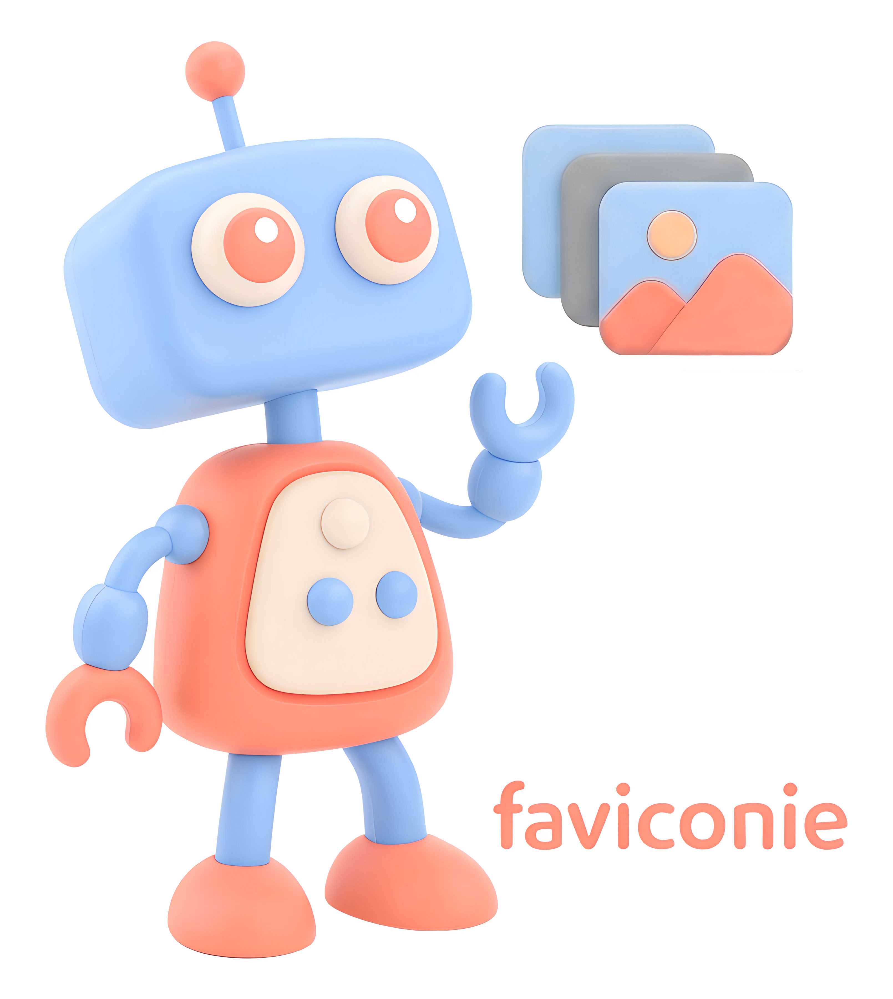

# Faviconie - Generate Favicons Action



Github Action to generate a complete, production-ready favicon set from a single source image — no online tools, no manual resizing, no data leaving your pipeline.

Supports SVG (recommended), PNG, JPG, WEBP and GIF sources. Outputs ICO, all PNG sizes, `site.webmanifest`, `browserconfig.xml`, and a ready-to-paste HTML snippet. Skips regeneration automatically if favicons already exist.

## Usage

Create a workflow file that contains a step using `andreia/generate-favicons@v1`:

```yaml
# .github/workflows/favicons.yml
name: Generate Favicons

on:
  push:
    branches: [main]
    paths:
      - "assets/logo.svg"

permissions:
  contents: write

jobs:
  favicons:
    runs-on: ubuntu-latest
    steps:
      - uses: actions/checkout@v4

      - name: Generate favicons
        id: favicons
        uses: andreia/generate-favicons@v1
        with:
          image:       assets/logo.svg
          output_path: public/favicons
          preset:      all
          commit:      "true"
```

> **Note:** The `paths:` filter is recommended so the action only runs when your source image actually changes. Even without it, the action exits instantly on subsequent runs because it skips generation when `favicon.ico` already exists.

## Inputs

- **`image`** _(required)_
  Path to the source image, relative to the repository root.
  SVG is strongly recommended — it renders pixel-perfect at every size using Inkscape.
  Also accepts PNG, JPG, WEBP, GIF. For raster sources, use 512×512 px or larger.

- **`output_path`** _(default: `public/favicons`)_
  Directory where all favicon files will be written. Created automatically if it does not exist.

- **`preset`** _(default: `all`)_
  Controls which sizes are generated:
  - `ico-only` — `favicon.ico` only (16×16 + 32×32 layers). Works in every browser since IE5.
  - `minimal` — ICO + 16, 32, 144, 152 px. Covers modern browsers and basic iOS/IE.
  - `extended` — ICO + 16, 32, 57, 72, 76, 114, 120, 144, 152, 192 px. Covers the real-world device spread.
  - `all` — Every known size plus `site.webmanifest`, `browserconfig.xml` and HTML snippet.
  - `custom` — You specify the exact sizes via the `sizes` input.

- **`sizes`** _(required when `preset: custom`)_
  Comma-separated pixel sizes to generate. Example: `16,32,180,192`.
  Available values: `16 24 32 48 57 60 64 70 72 76 96 114 120 128 144 150 152 167 180 192 196 256 310`.

- **`background_color`** _(default: `#ffffff`)_
  Hex color used as the background for opaque tile variants (Windows Metro / IE tiles).

- **`force`** _(default: `false`)_
  When `false`, the action skips all work if `favicon.ico` already exists in `output_path` — making it safe to include in every push workflow. Set to `true` to always regenerate and overwrite existing files.

- **`commit`** _(default: `false`)_
  When `true`, commits the generated files back to the repository using the built-in `GITHUB_TOKEN`. Requires `contents: write` permission on the workflow.

- **`commit_message`** _(default: `chore: update favicons [skip ci]`)_
  The commit message used when `commit: true`.

---

## Outputs

The following outputs are available to subsequent steps via `steps.<step-id>.outputs.<name>`:

- **`steps.favicons.outputs.skipped`**
  `"true"` if generation was skipped because `favicon.ico` already existed and `force` was not set. `"false"` if files were generated.

- **`steps.favicons.outputs.output_path`**
  Absolute path to the directory containing the generated favicons.

- **`steps.favicons.outputs.files_generated`**
  Number of favicon files written. `"0"` when skipped.

- **`steps.favicons.outputs.favicon_ico`**
  Absolute path to the generated `favicon.ico`. Empty string when skipped.

## Examples

### Basic — generate and upload as artifact

```yaml
- uses: actions/checkout@v4

- name: Generate favicons
  id: favicons
  uses: andreia/generate-favicons@v1
  with:
    image:   assets/logo.svg
    preset:  all

- name: Upload favicons
  if: steps.favicons.outputs.skipped == 'false'
  uses: actions/upload-artifact@v4
  with:
    name: favicons
    path: public/favicons/
```

### Generate and commit back to the repository

The generated files (PNGs, ICO, manifests, HTML snippet) are committed directly to your repo so they can be served as static assets.

```yaml
permissions:
  contents: write

steps:
  - uses: actions/checkout@v4

  - uses: andreia/generate-favicons@v1
    with:
      image:       assets/logo.svg
      output_path: public/favicons
      preset:      all
      commit:      "true"
```

---

### Force regeneration on demand

Useful when you've changed your logo but the ICO file already exists. Trigger manually with `force: true`:

```yaml
on:
  workflow_dispatch:
    inputs:
      force:
        description: "Regenerate even if favicons already exist?"
        default: "false"
        type: choice
        options: ["false", "true"]

steps:
  - uses: actions/checkout@v4

  - uses: andreia/generate-favicons@v1
    with:
      image:  assets/logo.svg
      preset: all
      force:  ${{ github.event.inputs.force }}
      commit: "true"
```

### Custom sizes only

When you know exactly what you need and don't want the full set:

```yaml
- uses: andreia/generate-favicons@v1
  with:
    image:  assets/logo.svg
    preset: custom
    sizes:  "16,32,180,192"
```

### Use outputs in later steps

```yaml
- name: Generate favicons
  id: favicons
  uses: andreia/generate-favicons@v1
  with:
    image:  assets/logo.svg
    preset: all

- name: Report result
  run: |
    if [[ "${{ steps.favicons.outputs.skipped }}" == "true" ]]; then
      echo "Skipped — favicons are already up to date."
    else
      echo "Generated ${{ steps.favicons.outputs.files_generated }} files"
      echo "Output path: ${{ steps.favicons.outputs.output_path }}"
      echo "favicon.ico: ${{ steps.favicons.outputs.favicon_ico }}"
    fi
```

## Adding the HTML snippet to your site

After the first run, copy the contents of `favicon-snippet.html` from `output_path` into the `<head>` of your HTML. All paths are relative so they work on any domain:

```html
<head>
  <!-- Universal fallback -->
  <link rel="shortcut icon" href="/favicon.ico">

  <!-- Standard PNG icons -->
  <link rel="icon" type="image/png" sizes="16x16"  href="/favicon-16x16.png">
  <link rel="icon" type="image/png" sizes="32x32"  href="/favicon-32x32.png">
  <link rel="icon" type="image/png" sizes="96x96"  href="/favicon-96x96.png">
  <link rel="icon" type="image/png" sizes="192x192" href="/favicon-192x192.png">

  <!-- Apple touch icons -->
  <link rel="apple-touch-icon" sizes="120x120" href="/favicon-120x120.png">
  <link rel="apple-touch-icon" sizes="152x152" href="/favicon-152x152.png">
  <link rel="apple-touch-icon" sizes="180x180" href="/favicon-180x180.png">

  <!-- Windows Metro / IE tile -->
  <meta name="msapplication-TileImage" content="/mstile-144x144.png">
  <meta name="msapplication-TileColor" content="#ffffff">
  <meta name="msapplication-config"    content="/browserconfig.xml">

  <!-- PWA / Android Chrome -->
  <link rel="manifest" href="/site.webmanifest">
  <meta name="theme-color" content="#ffffff">
</head>
```

The exact tags in your snippet will vary depending on which `preset` you used.

## Generated files

| File | Used by |
|---|---|
| `favicon.ico` | All browsers — universal fallback |
| `favicon-16x16.png` | Browser tab, Favourites bar |
| `favicon-32x32.png` | Taskbar shortcut, Safari Reading List |
| `favicon-57x57.png` | iPhone (non-Retina, iOS 6) |
| `favicon-60x60.png` | iPhone touch icon (iOS 7) |
| `favicon-72x72.png` | iPad non-Retina (iOS 6) |
| `favicon-76x76.png` | iPad touch icon (iOS 7) |
| `favicon-96x96.png` | GoogleTV |
| `favicon-114x114.png` | iPhone Retina (iOS 6) |
| `favicon-120x120.png` | iPhone Retina (iOS 7) |
| `favicon-128x128.png` | Chrome Web Store |
| `favicon-144x144.png` | IE10 Metro tile / iPad Retina (iOS 6) |
| `favicon-150x150.png` | IE11 Metro tile (square) |
| `favicon-152x152.png` | iPad Retina (iOS 7) |
| `favicon-167x167.png` | iPad Pro Retina |
| `favicon-180x180.png` | iPhone 6 Plus / X |
| `favicon-192x192.png` | Android Chrome M31+ / PWA |
| `favicon-196x196.png` | Android Chrome home screen |
| `favicon-256x256.png` | Windows desktop shortcut |
| `favicon-310x310.png` | IE11 Metro tile (large) |
| `mstile-*.png` | Windows 8.1 / IE11 (opaque background variants) |
| `mstile-310x150.png` | Metro wide tile |
| `browserconfig.xml` | Internet Explorer / Edge (Metro tile config) |
| `site.webmanifest` | Android Chrome / PWA home-screen icon |
| `favicon-snippet.html` | Ready-to-paste `<head>` HTML (relative paths) |
| `generation.log` | Full run log for debugging |
